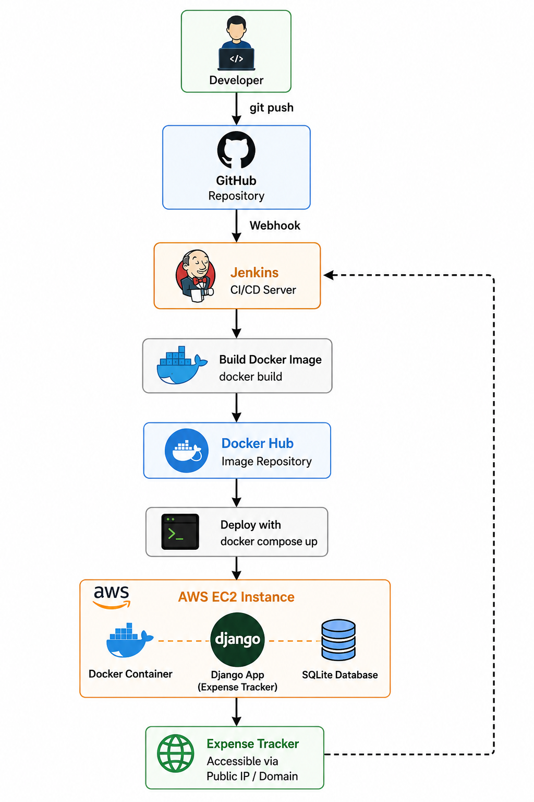
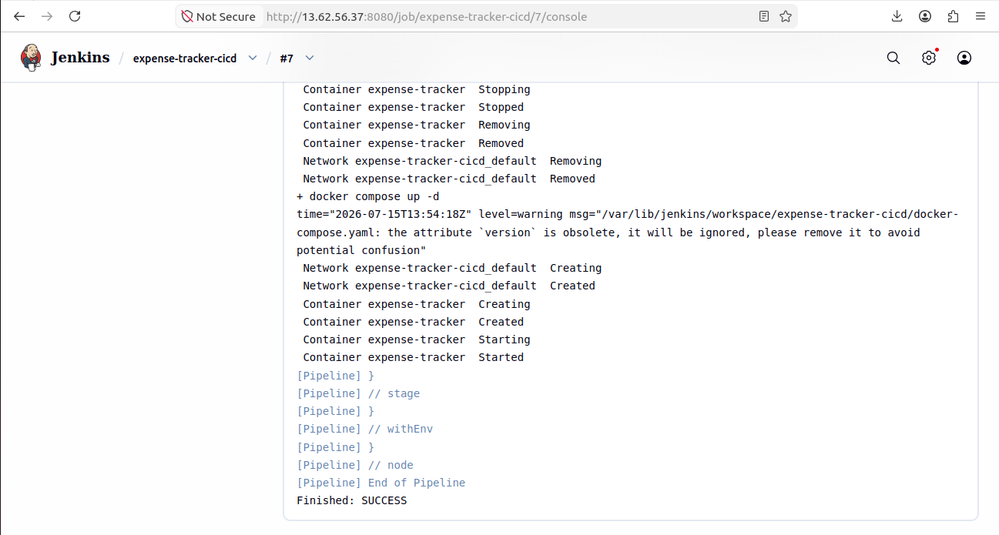
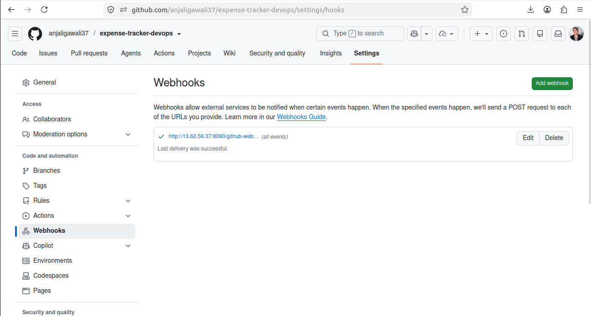
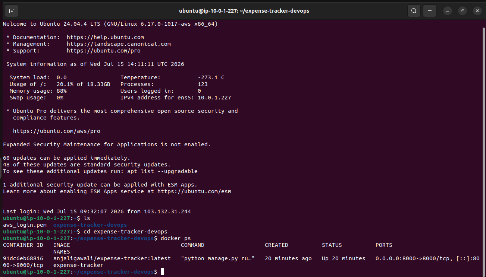
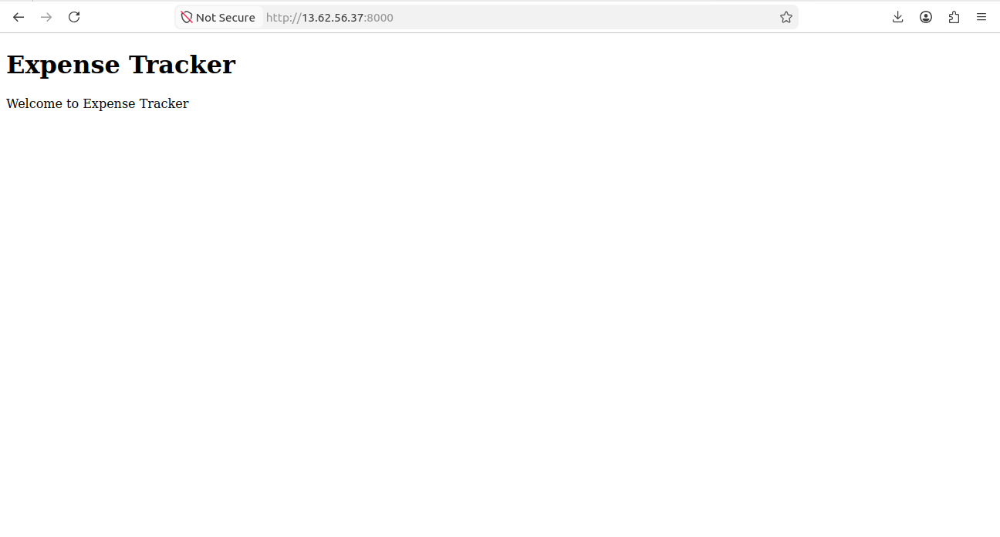

# 💰 Expense Tracker - CI/CD Pipeline with Jenkins, Docker & AWS

A Django-based Expense Tracker application demonstrating an end-to-end CI/CD pipeline using GitHub, Jenkins, Docker, Docker Hub, Docker Compose, and AWS EC2.

---
## 🏗️ CI/CD Architecture




## 🚀 Features

- User Registration & Login
- Add Expenses
- View Expenses
- Dockerized Django Application
- Automated CI/CD Pipeline
- Automatic Deployment using GitHub Webhooks
- Docker Hub Integration
- AWS EC2 Deployment

---

# 🛠️ Tech Stack

- Python
- Django
- SQLite
- Docker
- Docker Compose
- Jenkins
- Git
- GitHub
- GitHub Webhooks
- Docker Hub
- AWS EC2
- Ubuntu Linux

---

# 📂 Project Structure

```text
expense-tracker-devops/
│
├── accounts/
├── config/
├── dashboard/
├── expenses/
├── templates/
├── Dockerfile
├── docker-compose.yaml
├── Jenkinsfile
├── requirements.txt
├── manage.py
└── README.md
```

---

# ⚙️ CI/CD Workflow

```
Developer
      │
      ▼
Git Commit & Push
      │
      ▼
GitHub Repository
      │
      ▼
GitHub Webhook
      │
      ▼
Jenkins Pipeline
      │
      ├── Clone Repository
      ├── Build Docker Image
      ├── Push Docker Image to Docker Hub
      ├── Stop Existing Container
      └── Deploy New Container
      │
      ▼
AWS EC2 Instance
      │
      ▼
Expense Tracker Application
```

---
1. Developer pushes code to GitHub.
2. GitHub Webhook automatically triggers Jenkins.
3. Jenkins clones the latest source code.
4. Jenkins builds a Docker image.
5. Jenkins pushes the image to Docker Hub.
6. Docker Compose deploys the latest container on AWS EC2.
7. The Expense Tracker application is updated automatically.

# 🐳 Docker

## Build Image

```bash
docker build -t expense-tracker .
```

## Run Container

```bash
docker run -d -p 8000:8000 expense-tracker
```

---

# 🚀 Jenkins Pipeline Stages

- Clone Source Code
- Build Docker Image
- Push Image to Docker Hub
- Deploy using Docker Compose

---

# ☁️ Deployment

The application is deployed on an AWS EC2 Ubuntu instance.

Deployment is completely automated using:

- GitHub Webhooks
- Jenkins Pipeline
- Docker
- Docker Compose

Whenever code is pushed to the **main** branch:

1. GitHub sends a webhook to Jenkins.
2. Jenkins automatically starts the pipeline.
3. Docker builds a new image.
4. The image is pushed to Docker Hub.
5. Docker Compose deploys the latest container on AWS EC2.

---
# 📸 Screenshots

## Jenkins Pipeline



## GitHub Webhook



## Docker Container



## Running Application



---

# 📖 Learning Outcomes

This project helped me gain practical experience with:

- CI/CD Pipeline
- Jenkins Automation
- GitHub Webhooks
- Docker
- Docker Compose
- Docker Hub
- AWS EC2
- Linux
- Django Deployment

---

# 👩‍💻 Author

**Anjali Gawali**

GitHub: https://github.com/anjaligawali37

LinkedIn: *https://www.linkedin.com/in/anjali-gawali-248b2a399/*

---

⭐ If you found this project useful, consider giving it a star!
